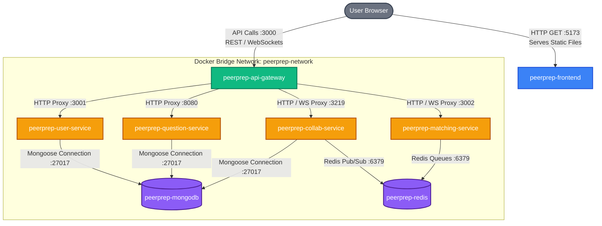

# PeerPrep Containerization Report

This document outlines the containerization strategy and local deployment process for the PeerPrep microservices architecture.

## 1. Containerization Coverage

The entire PeerPrep system is orchestrated using a single **`docker-compose.yml`** file. This ensures that all services, including back-end microservices, the front-end, and database dependencies, can be started with a single command.

### Services Included:
*   **Back-end Microservices**:
    *   `user-service`: Handles user authentication and profiles.
    *   `question-service`: Manages the bank of technical interview questions.
    *   `collab-service`: Manages real-time collaborative editing sessions and chat.
    *   `matching-service`: Manages finding available peers and pairing them together.
*   **Internal Infrastructure**:
    *   `api-gateway`: Unified entry point that proxies requests to back-end services.
*   **Front-end Application**:
    *   `frontend`: React/Vite-based UI served via Nginx.
*   **Databases**:
    *   `peerprep-mongodb`: Local MongoDB instance (optional, switchable to Cloud Atlas).
    *   `peerprep-redis`: In-memory data store for collaboration state.

### Starting the System:
To start the entire system, run the following command from the root directory:

```bash
docker compose up --build
```

---

## 2. Dockerfile Strategy

A standardized strategy was applied to all microservices to ensure small, secure, and production-ready images.

### Key Strategies:
1.  **Choice of Base Image (`node:20-alpine`)**:
    *   **Lightweight**: Alpine Linux significantly reduces the image size (from ~1GB to ~150MB).
    *   **Security**: Smaller attack surface due to fewer pre-installed packages.
2.  **Multi-Stage Builds**:
    *   **Stage 1 (Builder)**: Installs all dependencies (including `devDependencies`) and compiles source code where necessary (e.g., `frontend` build).
    *   **Stage 2 (Runtime)**: Copies only the necessary application context and production `node_modules`. This keeps the final image clean of build-time artifacts and source control junk.
3.  **Cross-Platform Resolution**:
    *   Since local development on macOS creates a `package-lock.json` with OS-specific binaries (like `@rollup/rollup-linux-arm64-musl`), the `frontend/Dockerfile` specifically avoids `npm ci` and runs `RUN rm -f package-lock.json && npm install`. This recreates the lockfile using the necessary Linux binaries directly within the container context.
4.  **Context Optimization**:
    *   **`.dockerignore`**: Prevents unnecessary files like `.git` and `node_modules` (local) from being sent to the Docker daemon. Notably, `frontend/.env` is deliberately *omitted* from `.dockerignore` so that Vite can inject environment variables natively during `npm run build`.
5.  **Health Checks**:
    *   Custom `healthcheck` commands were added to the `mongodb` and `redis` services. The microservices are configured to wait until these health checks pass (`condition: service_healthy`) before attempting to connect, preventing "Connection Refused" errors on startup.

---

## 3. Inter-service Communication

The services communicate seamlessly using **Docker's Internal DNS** and a dedicated bridge network.

### Architecture Overview:



### Key Technical Details:
*   **Internal DNS**: Docker's embedded DNS server allows services to resolve other containers by their service names (e.g., `http://user-service:3001`, `redis://redis:6379`).
*   **Zero-Intervention Configuration**: All connection strings are managed via **Environment Variables** in `.env` files or injected directly via `docker-compose.yml`. For example, the `api-gateway` defines:
    *   `USER_SERVICE_URL=http://user-service:3001`
    *   `MATCHING_SERVICE_URL=http://matching-service:3002`
*   **Frontend Environment Injection Mechanism**: Because Vite generates a static application, frontend environment variables (`VITE_*`) must be injected at *build time*. Therefore, `.env` is specifically **included** in the Frontend container builder stage.
*   **Isolation**: Only ports `3000` (API Gateway) and `5173` (Frontend Web Host) need to be exposed to the host machine. All microservice REST traffic and database connections remain private within the Docker network.
